# DJI Bridge App Tutorial

<!-- toc -->

This tutorial is designed for you to gain a better understanding of the DJI Bridge App. It will teach you how to use it for app debugging by implementing the live video view and two basic camera functionalities: "Take Photo" and "Record video".

   You can download the [DJI Bridge App Project](https://github.com/dji-sdk/DJI-Bridge-App), build and install it on your mobile device. Also, you can download the entire sampe project for this tutorial from the current **Github Page**. 
   
## Introduction

The design of the DJI Bridge App is simple. It's a universal app supports both iPhone and iPad. You can use it to debug app for Phantom 3 Professional, Phantom 3 Advanced, Inspire 1, M100 and other products using USB/MFI connection between RC and your app.

### Workflow

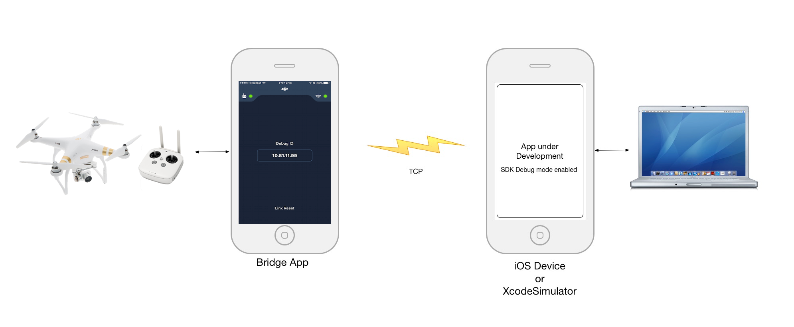

As you see above, the Bridge App and the iOS Device or Xcode Simulator should work in the same local network using TCP service to communicate. You can connect them to the same WiFi network or connect to a local wireless connection created on your Mac too. 

### Signal Light

At the top of the screen, there are two signal lights, which represent the connection between the bridge app and the remote controller or your application. When the bridge app connect to the remote controller successfully, the **RC light** will turn green. Similarly, when the bridge app connect to your app successfully, the **App Light** will turn green too.

### TCP Connection

The bridge app uses TCP sockets to communicate with your app. It use **Debug Id** to distinguish between different bridge apps running on different mobile devices.

TCP connection is stable and supports security network, which means your local network has firewall. The debug ID will change in different IP addresses.

Now try to open the bridge app, and connect your mobile device to the remote controller using usb cable, you should see the RC Light turn green!

> **Note**: 
> 
> **1.** If you connect the bridge app to the RC and the RC light is still red, you may need to restart the app and try again. It should works.
> 

### Link Reset

   If the bridge app cannot connect to your app successfully because of switching your mobile device's wifi network or other unknown situations, you can press the **Link Reset** button at the bottom to force restart the TCP service to refresh the Debug ID.
   
## Download and Import the SDK

You can download the iOS SDK 3.0 Beta from here: <https://github.com/dji-dev/DJI-Mobile-SDK-Beta>

If you are not familiar with importing the SDK to your Xcode project, please check this tutorial on Github: [Creating a Camera Application](https://github.com/DJI-Mobile-SDK/iOS-FPVDemo)

## Implement the Live Video View

  **1**. We use the FFMPEG decoding library (found at http://ffmpeg.org) to decode the video stream. You can find the **VideoPreviewer** folder in the downloaded SDK. Copy the entire **VideoPreviewer** folder to your Xcode project's folder and then add it to the Xcode project navigator, as shown below:
  
 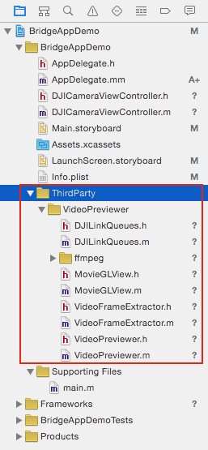
 
 **2**. Go to XCode -> Project -> Build Phases -> Link Binary With Libraries and add the **libiconv.tbd** library. Then, set the **Header Search Paths** in **Build Settings** to the path of the **~/include** folder in the **FFMPEG** folder. Also, set the **Library Search Paths** to the path of the **~/lib** folder in the **FFMPEG** folder, as shown below:
 
  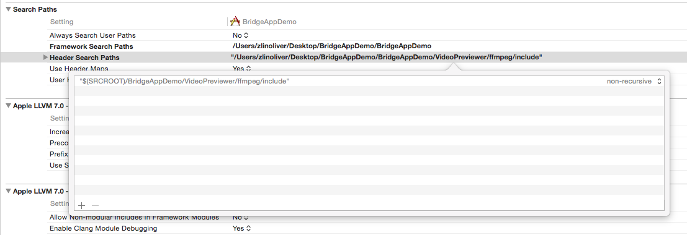
  
  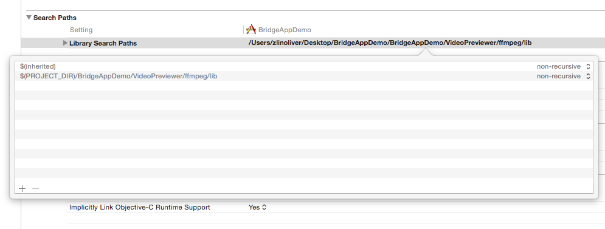
  
  **3**. In Main.storyboard, add a new View Controller and call it **DJICameraViewController**. Set **DJICameraViewController** as the root View Controller for the new View Controller you just added in Main.storyboard:
  
  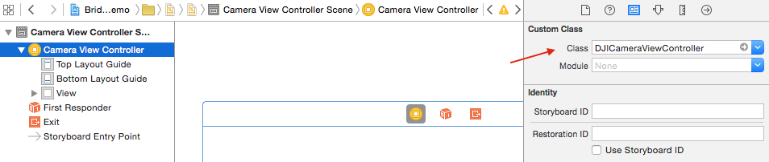
  
Add a UIView inside the View Controller and set it as an IBOutlet called "**fpvPreviewView**". Then, add two UIButtons and one UISegmentedControl at the bottom of the View Control and set their IBOutlets and IBActions, as shown below:
  
  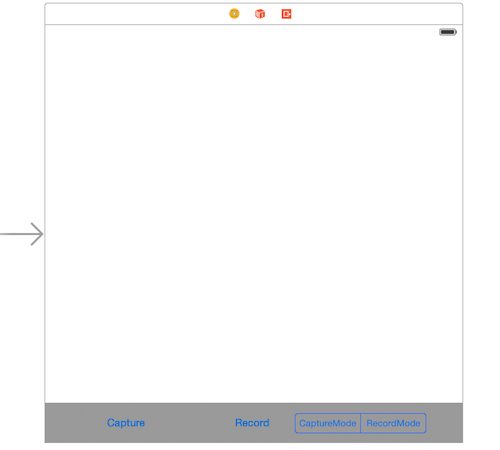
  
  Go to **DJICameraViewController.m** file and import the **DJISDK** and **VideoPreviewer** header files. Then create a **DJICamera** property and implement its delegate protocol as below:
  
~~~objc
#import <DJISDK/DJISDK.h>
#import "VideoPreviewer.h"

@interface DJICameraViewController ()<DJICameraDelegate>

@property (nonatomic, strong) DJICamera* camera;
@property (weak, nonatomic) IBOutlet UIButton *recordBtn;
@property (weak, nonatomic) IBOutlet UISegmentedControl *changeWorkModeSegmentControl;
@property (weak, nonatomic) IBOutlet UIView *fpvPreviewView;
@property (weak, nonatomic) IBOutlet UILabel *currentRecordTimeLabel;

- (IBAction)captureAction:(id)sender;
- (IBAction)recordAction:(id)sender;
- (IBAction)changeWorkModeAction:(id)sender;
~~~

**4**. Implement the DJISDKManagerDelegate method as shown below:
  
~~~objc

- (void)showAlertViewWithTitle:(NSString *)title withMessage:(NSString *)message
{
    UIAlertController *alert = [UIAlertController alertControllerWithTitle:title message:message preferredStyle:UIAlertControllerStyleAlert];
    UIAlertAction *okAction = [UIAlertAction actionWithTitle:@"OK" style:UIAlertActionStyleDefault handler:nil];
    [alert addAction:okAction];
    [self presentViewController:alert animated:YES completion:nil];
}

#pragma mark DJISDKManagerDelegate Method

-(void) sdkManagerProductDidChangeFrom:(DJIBaseProduct* _Nullable) oldProduct to:(DJIBaseProduct* _Nullable) newProduct
{
    if ([newProduct isKindOfClass:[DJIAircraft class]]) {
        DJIAircraft* aircraft = (DJIAircraft*)newProduct;
        self.camera = aircraft.camera;
        self.camera.delegate = self;
        [self.camera startCameraStateUpdates];
    }
}

~~~

 The delegate method above is called when SDK detect a product. Here we create a **DJIAircraft** instance variable and initialize the DJICamera property variable from it. Then we set the camera variable's delegate to self and call its `-(void) startCameraStateUpdates;` method to update camera state.
  
 Moreover, in the viewWillAppear method, set "fpvPreviewView" instance as a View of VideoPreviewer to show the Video Stream and reset it to nil in the viewWillDisappear method:
 
~~~objc
- (void)viewWillAppear:(BOOL)animated
{
    [super viewWillAppear:animated];
    [[VideoPreviewer instance] setView:self.fpvPreviewView];
}

- (void)viewWillDisappear:(BOOL)animated
{
    [super viewWillDisappear:animated];
    [[VideoPreviewer instance] setView:nil];   
}
~~~
  
  Lastly, implement the DJICameraDelegate method, as shown below:
  
~~~objc
#pragma mark - DJICameraDelegate

-(void) camera:(DJICamera*)camera didReceivedVideoData:(uint8_t*)videoBuffer length:(size_t)length
{
    uint8_t* pBuffer = (uint8_t*)malloc(length);
    memcpy(pBuffer, videoBuffer, length);
    [[VideoPreviewer instance].dataQueue push:pBuffer length:(int)length];
}
~~~

  `-(void) camera:(DJICamera*)camera didReceivedVideoData:(uint8_t*)videoBuffer length:(size_t)length` method is used to send the video stream to **VideoPreviewer** to decode.
 
## Enter Debug Mode

**1**. Implement the **DJISDKManagerDelegate** protocol method in the DJICameraViewController.m file's extension part. Then create a new method named **registerApp** and invoke it in the viewDidAppear method as shown below:

~~~objc
- (void)registerApp
{
    NSString *appKey = @"Enter Your App Key Here";
    [DJISDKManager registerApp:appKey withDelegate:self];
}

- (void)viewDidAppear:(BOOL)animated {
    [super viewDidAppear:animated];
    [self registerApp];    
}
~~~

> Note: If you don't know how to apply as a DJI developer and get the App Key, please refer to this [link](http://developer.dji.com/get-started/mobile-sdk/Register-Download).

**2**. Next, let's implement the DJISDKManagerDelegate method as shown below:

~~~objc
- (void)sdkManagerDidRegisterAppWithError:(NSError *)error
{
    NSString* message = @"Register App Successed!";
    if (error) {
        message = @"Register App Failed! Please enter your App Key and check the network.";
    }else
    {
        NSLog(@"registerAppSuccess");
        [DJISDKManager enterDebugModeWithDebugId:@"Please type in Debug ID of the DJI Bridge app here"];
        [[VideoPreviewer instance] start];
    }
    
    [self showAlertViewWithTitle:@"Register App" withMessage:message];
}
~~~

The delegate method above gets called when the app is registered. If the registration is successful, we can call the `+(void) enterDebugModeWithDebugId:(NSString*)debugId;` class method of **DJISDKManager** to enter debug mode of the SDK by passing the **Debug Id** parameter, which you can get from **the Bridge App**. Then call the start method of the VideoPreviewer class to start video decoding.

**3**. Build and Run the project in Xcode. If everything is OK, you will see a "Register App Successed!" alert once the application loads. 
  
  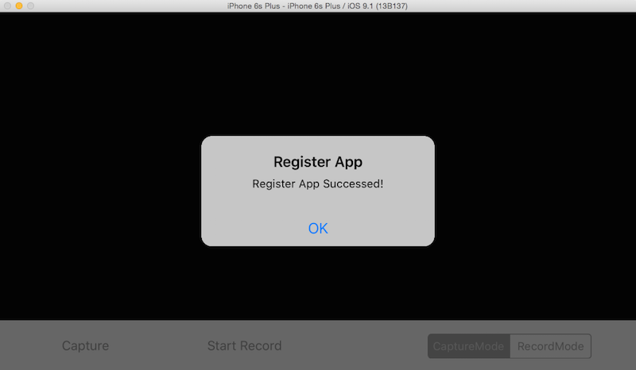

## Debug Live Video View on iOS Simulator

After you finish the steps above, you can now connect the DJI Bridge app to your aircraft to try debugging the Live Video View on your **iOS Simulator**. Here are the guidelines:

 In order to connect to DJI Inspire 1, Phantom 3 Professional, Phantom 3 Advanced or M100:

  **1**. First, turn on your remote controller and connect it to the mobile device which is running the DJIBridge app.
  
  **2**. Trust the device if an alert asking “Do you trust this device” comes up.
  
  **3**. Make sure your mobile device connect to the same WiFi network to your Mac.

  **4**. Then, turn on the power of the aircraft.
  
  **5**. Now build and run the project in Xcode, wait for a few seconds, you will be able to view the live video stream from your aircraft's camera on your iOS simulator now!
    
Here are the screenshots of the bridge app and iOS simulator if everthing goes well:

  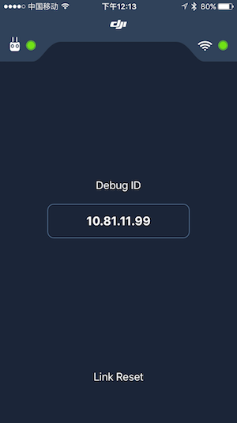
  
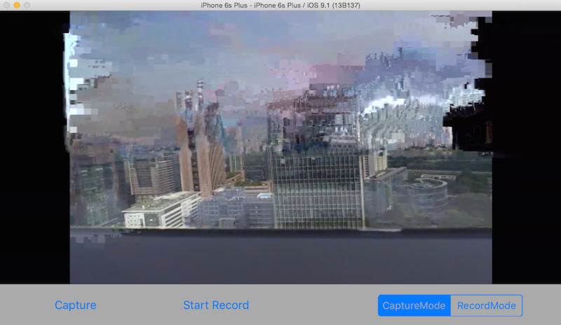

> **Note:** 
> 
> **1.** If you cannot see the live video, please check the log message in Xcode's console and try to move your aircraft around the RC. The live video should show up.
> 
> **2.** You may notice that the live video has mosaics. It's due to the delayed transmission and the software decoding quality of iOS Simulator.

Congratulations! By using the bridge app, you can now debug your app with all the Xcode features, like adding **Breakpoints** in your code, using **Instruments** to profile the app, etc. Let's move forward.

## Implement the Capture and Record function

Create a BOOL property variable named **isRecording** in the DJICameraViewController.m file's extension part and implement the DJICameraDelegate method as shown below:

~~~objc

- (NSString *)formattingSeconds:(int)seconds
{
    NSDate *date = [NSDate dateWithTimeIntervalSince1970:seconds];
    NSDateFormatter *formatter = [[NSDateFormatter alloc] init];
    [formatter setDateFormat:@"mm:ss"];
    [formatter setTimeZone:[NSTimeZone timeZoneForSecondsFromGMT:0]];
    
    NSString *formattedTimeString = [formatter stringFromDate:date];
    return formattedTimeString;
}

-(void) camera:(DJICamera*)camera didUpdateSystemState:(DJICameraSystemState*)systemState
{
    self.isRecording = systemState.isRecording;
    
    [self.currentRecordTimeLabel setHidden:!self.isRecording];
    [self.currentRecordTimeLabel setText:[self formattingSeconds:systemState.currentVideoRecordingTimeInSeconds]];
    
    if (self.isRecording) {
        [self.recordBtn setTitle:@"Stop Record" forState:UIControlStateNormal];
    }else
    {
        [self.recordBtn setTitle:@"Start Record" forState:UIControlStateNormal];
    }
    
    //Update UISegmented Control's state
    if (systemState.workMode == DJICameraModeShootPhoto) {
        [self.changeWorkModeSegmentControl setSelectedSegmentIndex:0];
    }else if (systemState.workMode == DJICameraModeRecordVideo){
        [self.changeWorkModeSegmentControl setSelectedSegmentIndex:1];
    }
    
}
~~~

The delegate method above is used to get the camera state from the camera on your aircraft. It will be called frequently, so you can update your user interface or camera settings accordingly here. We update the **currentRecordTimeLabel**'s text with latest recording time. Then, update the recordBtn's title with the correct state. Lastly, update the changeWorkModeSegmentControl's selected index with **systemState**'s workMode value.
  
Once you finish it, let's implement the **captureAction**, **recordAction** and **changeWorkModeAction** IBAction methods, and show an alertView when error occurs as shown below:

~~~objc
- (IBAction)captureAction:(id)sender {
    
    __weak DJICameraViewController *weakSelf = self;
    [self.camera startShootPhoto:DJICameraPhotoShootModeSingle withCompletion:^(NSError * _Nullable error) {
        if (error) {
            [weakSelf showAlertViewWithTitle:@"Take Photo Error" withMessage:error.description];
        }
    }];
    
}

- (IBAction)recordAction:(id)sender {
    
    __weak DJICameraViewController *weakSelf = self;
    
    if (self.isRecording) {
        [self.camera stopRecordVideoWithCompletion:^(NSError * _Nullable error) {
            if (error) {
                [weakSelf showAlertViewWithTitle:@"Stop Record Video Error" withMessage:error.description];
            }
        }];
    }else
    {
        [self.camera startRecordVideoWithCompletion:^(NSError * _Nullable error) {
            if (error) {
                [weakSelf showAlertViewWithTitle:@"Start Record Video Error" withMessage:error.description];
            }
        }];
    }
    
}

- (IBAction)changeWorkModeAction:(id)sender {
    
    __weak DJICameraViewController *weakSelf = self;
    UISegmentedControl *segmentControl = (UISegmentedControl *)sender;
    if (segmentControl.selectedSegmentIndex == 0) { //Take photo
        
        [self.camera setCameraMode:DJICameraModeShootPhoto withCompletion:^(NSError * _Nullable error) {
            if (error) {
                [weakSelf showAlertViewWithTitle:@"Set DJICameraModeShootPhoto Failed" withMessage:error.description];
            }
            
        }];
        
    }else if (segmentControl.selectedSegmentIndex == 1){ //Record video
        
        [self.camera setCameraMode:DJICameraModeRecordVideo withCompletion:^(NSError * _Nullable error) {
            if (error) {
                [weakSelf showAlertViewWithTitle:@"Set DJICameraModeRecordVideo Failed" withMessage:error.description];
            }
            
        }];
        
    }
    
}
~~~
   
   Now, we can build and run the project. You can try to play with the **Record** and **Switch Camera WorkMode** functions, if everything is going well, you should see the simulator screenshot like this:
   
   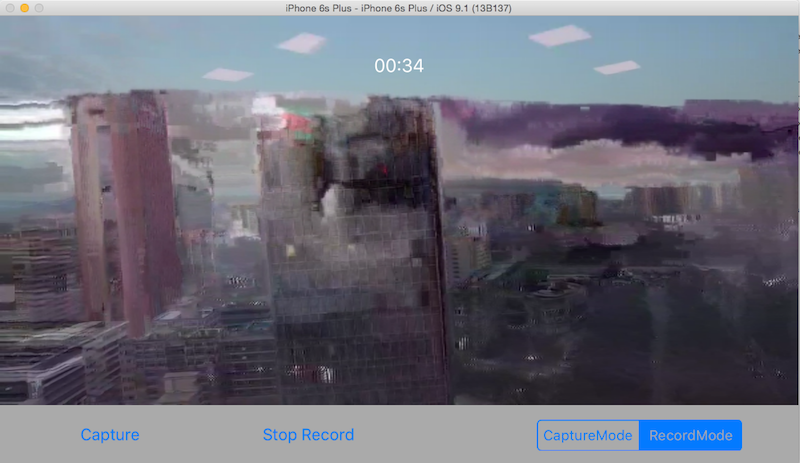
   
## Debug on Actual iOS Device

   Currently, we are running the app on **iOS Simulator**. Although the iOS Simulator is extremely useful during app development, when you want to ensure the required functionality and performance of an application, such as App Memory Usage, Hardware usage like Accelerometer, Gyroscope, etc, testing on an actual device is still required. For more difference between iOS Simulator and actual iOS device, please refer to [iOS Simulator Vs. Actual Device Testing](http://bluetubeinc.com/blog/2014/11/ios-simulator-vs-device-testing).
   
   The good thing is DJI Bridge app supports actual iOS device debugging. You can find another iOS device, like an iPhone 6, iPad air 2, etc, and connect it to your Mac. Then build and run the project on it. It should work perfectly the same to the iOS Simulator.
   
## Debug on DJI Product requires WiFI Connection

   For the Phantom 3 Standard and OSMO, you cannot use DJI Bridge App to debug your application because they use WiFi to connect between your application and the remote controller or the handheld device.
   
   Actually you can work without the DJI Bridge App. Let's add a Macro named "ENABLE_DEBUG_MODE" above the DJICameraViewController.m file's extension part as shown below:
   
~~~objc
#import "DJICameraViewController.h"
#import <DJISDK/DJISDK.h>
#import "VideoPreviewer.h"

#define ENABLE_DEBUG_MODE 0

@interface DJICameraViewController ()<DJICameraDelegate, DJISDKManagerDelegate>

~~~

  Then go to `- (void)sdkManagerDidRegisterAppWithError:(NSError *)error` method and replace the code with the following:
  
~~~objc
- (void)sdkManagerDidRegisterAppWithError:(NSError *)error
{
    NSString* message = @"Register App Successed!";
    if (error) {
        message = @"Register App Failed! Please enter your App Key and check the network.";
    }else
    {
        NSLog(@"registerAppSuccess");
        
#if ENABLE_DEBUG_MODE
        [DJISDKManager enterDebugModeWithDebugId:@"Please type in Debug ID of the DJI Bridge app here"];
#else
        [DJISDKManager startConnectionToProduct];
#endif
        [[VideoPreviewer instance] start];
    }
    [self showAlertViewWithTitle:@"Register App" withMessage:message];
}
~~~

   As the code shown above, if you don't want to use debug mode of the SDK with DJI Bridge app, you can call `+ (void)startConnectionToProduct;` class method of DJISDKManager instead once the app registration is successful.
   
   Finally, connect your Mac, which uses iOS Simulator to debug, or your iOS device's WiFi network to DJI Product. Build and run the application on your Mac, if everthing goes well, you should see the following screenshot for iOS Simulator:
   
   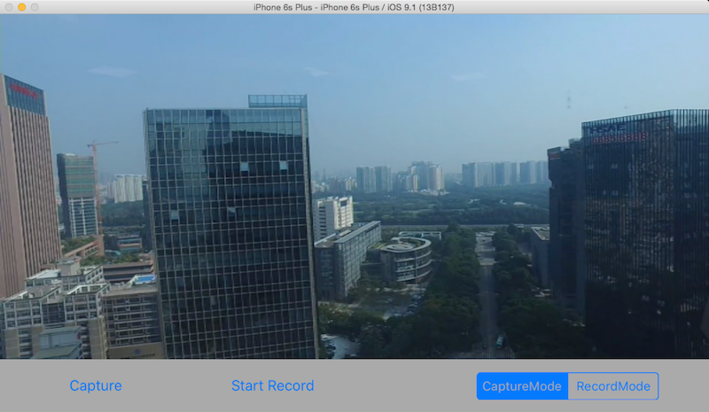
      
>**Notes:**
>
>**1.** If it's the first time to run the application, which isn't registered before, you may need to connect your Mac or iOS device's WiFi to the internet and build and run the app for registration. Next time, you can connect their WiFi back to the DJI Product to debug without problems.
>
>**2.** You may notice the video is clear without mosaic. Because the iOS device use hardware decoding for live video, which is better than software decoding.
>

## Summary

   Congratulations! You've learned how to use DJI Bridge App to debug your application using DJI Mobile SDK. Also, for better understanding, the tutorial shows you how to show the live video view from the DJI Product's camera and control the camera to take photo and record video too. 
   
   With DJI Bridge App, you can build your application with DJI Mobile SDK more efficiently. Hope you enjoy this tutorial, Thanks!