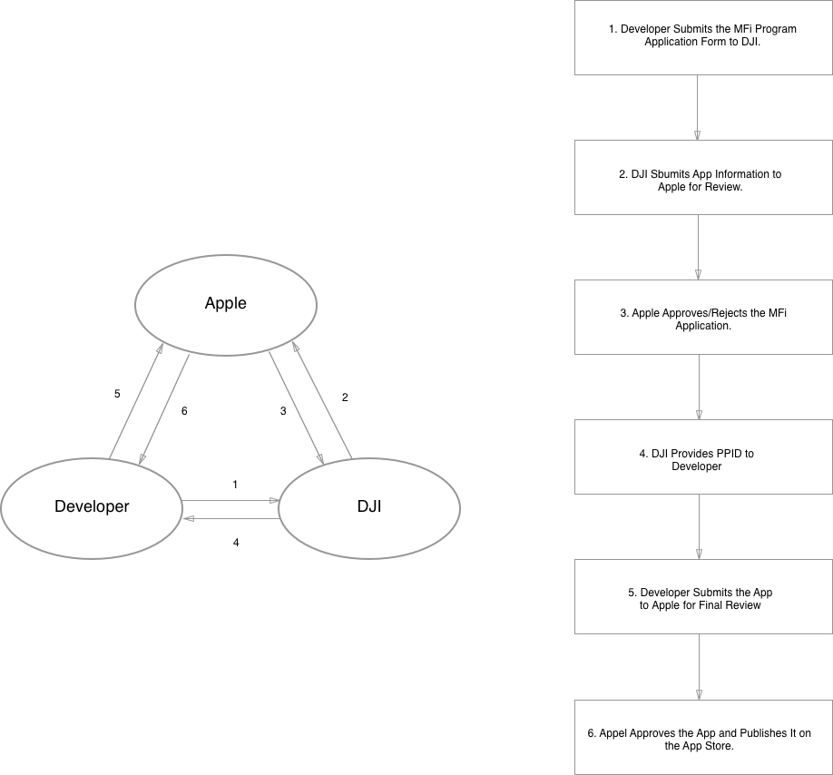
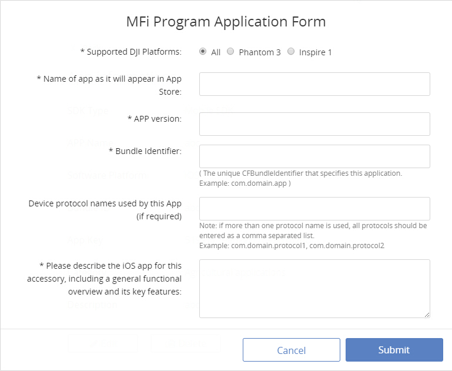
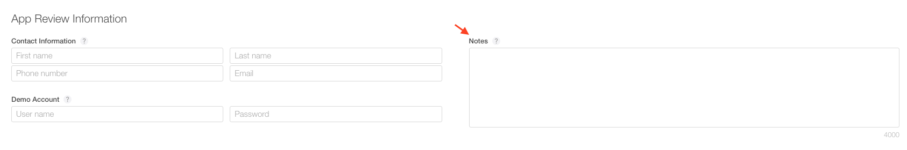

# iOS MFi Program Apply Process

## Why to Apply the MFi Program

The MFi Program encompasses third-party hardware accessories that use Apple's MFi licensed technology to connect electronically to iPhone, iPod and Apple Watch. Since the Phantom 3 Series and the Inspire 1 Series, we have been using the Lightning port to communicate with iOS devices. Therefore, all the iOS apps developed using DJI Mobile SDK need to go through the MFi Porgram Application Process before being released on the App Store.

## How to Apply the MFi Program

 

The  picture above shows the six steps for applying for the MFi Program.

### 1. Developer Submits the MFi Program Application Form to DJI

Login to your account at <http://developer.dji.com>. Fill out the MFi Program Application Form in your User Center for the specific app that you want to release.

### 2. DJI Submits App Information to Apple for Review

After receiving your application form, DJI would record the app information   and send to Apple
for review.

### 3. Apple Approves/Rejects the MFi Application

Normally it would take up to ten business days for  Apple to finish the review process.   Once approved, a corresponding PPID code would be provided by Apple.

### 4. DJI Provides PPID to Developer

nce approved, y you will be given a corresponding PPID (Product Part Identification) code through the status bar in your User enterThe PPID code indicates
which hardware device your app communicates with which will be used in Step 5 when submitting your app to Apple for final review.

### 5. Developer Submits the App to Apple for Final Review

During the submission process, we need to put the PPID to the **Notes** in the App Review Information webpage with the picture as follows. 

### 6. Apple Approves the App and Publishes It on the App Store
