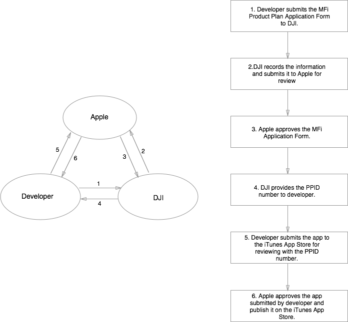

# MFi Approval Process for iOS Apps using DJI Mobile SDK

## Why to Apply for It

The [MFi Program](https://developer.apple.com/programs/mfi/) ("Made for iPhone/iPod/iPad") is a licensing program for developers of hardware and software peripherals that work with Apple's iPod, iPad and iPhone.

In order to offer your app on the Apple iTunes App Store with DJI SDK, your app needs to be approved under DJI's MFi program before you submit it to the Apple iTunes App Store. Please follow the instructions below.

## WorkFlow

 

The above diagram shows the 6 steps for making your app approved by Apple MFi Program.

### 1. Submit the MFi Program Application to DJI

Send an email to the sdk@dji.com to get an application form. Fill in all the details and send it back to sdk@dji.com.

### 2. DJI submits your App information to Apple

After receiving your application, DJI records it under our MFi program and sends to Apple for review.

### 3. Apple approves the MFi Program application and notifies DJI

Generally it would take 1 - 2 weeks for Apple to review. 

### 4. DJI provides PPID to developer

After Apple notifies DJI that your App information has been approved, DJI will provide you an MFI Product Plan ID (PPID) number. 

### 4. Submit your App to iTunes App Store for App Review

You can submit your App to the Apple iTunes App Store through iTunes Connect with the MFI PPID number in the "Review Notes (Optional)" section of the App Review Information. (e.g. MFI PPID *********-*******). The Review Notes of iTunes Connect looks like this:

In some cases, DJI might provide multiple PPIDs. Please ensure you enter all the PPIDs in the Review Notes section.

### 6. Apple approves your App and publish it on iTunes App Store

Apple (iTunes connect) will review your App and release it on the App Store. Approval may takes 1 - 2 weeks.
