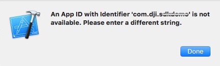
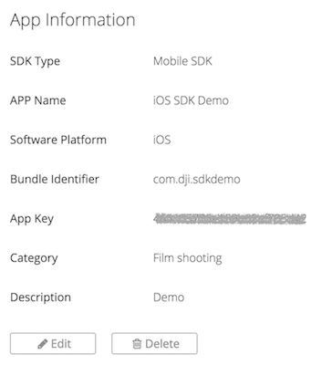
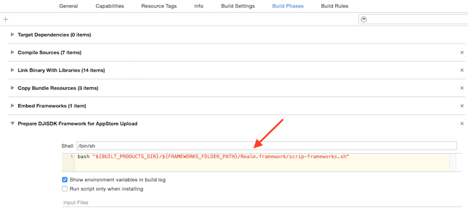
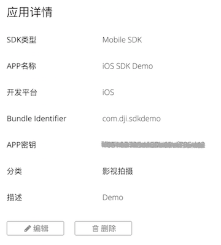

# DJI Mobile SDK for iOS

[English](#what-is-this) | [中文](#这是什么)

## What Is This?

The DJI Mobile SDK enables you to control how your Phantom’s camera, gimbal, and more behaves and interacts with mobile apps you create. Using the Mobile SDK, create a customized mobile app to unlock the full potential of your DJI aerial platform.

## Running the SDK Sample Code

This guide shows you how to setup APP Key and run our DJI Mobile SDK sample project, which you can download from this **Github Page**.

### Prerequisites

- Xcode 7.0+ or higher
- Deployment target of 8.1 or higher

### Registering an App Key

Firstly, please go to your DJI Account's [User Center](http://developer.dji.com/en/user/apps), select the "Apps" tab on the left, press the "Create App" button and select "iOS" as your operating system. Then type in the info in the pop up dialog.

>Note: Please type in "com.dji.sdkdemo" in the `Bundle Identifier` field, because the default Bundle Identifier in the sample Xcode project is "com.dji.sdkdemo".
>
>If you cannot build and run the Sample app on your iOS device and see the following error, please change the `Bundle Identifier` to what you prefer and apply for an DJI App Key again.
>
>

Once you complete it, you may see the following App Key status:

Please record the App Key you just created and we will use it in the following steps.

### Running the Sample Xcode project

#### Objective C Sample:

Please download or clone this Github Project repository and navigate to **Sample Code-> ObjcSampleCode**. Open the "DJISdkDemo.xcodeproj" project in Xcode, modify the **DJIRootViewController.m** file by assigning the App Key string we just created to the **appKey** object like this:

~~~objc
- (void)viewDidLoad {
    [super viewDidLoad];
    
    //Register App with App Key
    NSString* appKey = @""; //TODO: Please enter your App Key here
    
    if ([appKey length] == 0) {
        ShowResult(@"Please enter your app key.");
    }
    else
    {
        [DJISDKManager registerApp:appKey withDelegate:self];
    }
    
    [self initUI];
}
~~~

#### Swift Sample:

Please download or clone this Github Project repository and navigate to **Sample Code-> SwiftSampleCode**. Open the "DJISDKSwiftDemo.xcodeproj" project in Xcode, modify the **StartupViewController.swift** file by assigning the App Key string we just created to the **APP_KEY** object like this:

~~~swift
let APP_KEY = ""//TODO: Please enter App Key Here

override func viewDidLoad() {
    super.viewDidLoad()
    
    if(APP_KEY.isEmpty){
        showAlert("Please enter your app key.")
    }else
    {
        DJISDKManager.registerApp(APP_KEY, withDelegate: self)
    }
    
    initUI();
}
~~~

> Notes:
> 
> - In order to enable your app to connect to the MFI remote controller, you must add "Supported external accessory protocols" items in the info.plist file as shown below:
> 
> 
> - Since in iOS 9, App Transport Security has blocked a cleartext HTTP (http://) resource load since it is insecure. You must add "App Transport Security Settings" items in the info.plist file as shown below:
> 
> 
> - In order to prepare your app for App Store submission, create a new "Run Script Phase" in your app's target's "Build Phases" and paste the following snippet in the script text field(see below image): `bash "${BUILT_PRODUCTS_DIR}/${FRAMEWORKS_FOLDER_PATH}/DJISDK.framework/strip-frameworks.sh"` This step is required to work around an App Store submission bug when archiving universal binaries.
> 

Once you finish it, build and run the project on your iOS Device. Then connect the iOS device to the Remote Controller, turn on the Remote Controller and the aircraft or handheld device. You can start to try different features in the sample project without any problems.

## DJI Bridge App

DJI Bridge App is a universal app supports both iPhone and iPad. You can use it to debug app for Phantom 4, Phantom 3 Professional, Phantom 3 Advanced, Inspire 1, M100 and other products using USB/MFI connection between RC and your app.

For more details, please check the [**DJI Bridge App Tutorial**](https://github.com/DJI-Mobile-SDK/DJIBridgeAppDemo).

You can download the DJI Bridge App source code to build and run the app on your iOS device from here: <https://github.com/dji-sdk/DJI-Bridge-App>.

## DJI Remote Logger

DJI Remote Logger is a tool to show the log messages in your source code on a webpage. It use Ruby log server to show log contents.

For more details, please check the [**DJI Remote Logger Tutorial**](https://github.com/DJI-Mobile-SDK/DJIRemoteLoggerDemo)

## FFmpeg Customization

We have forked the original FFmpeg and add customized features to provide more infos of video frame, including frame's width and height, frame rate number, etc. These features will help to implement video hardware decoding. 

The SDK Sample Code uses code of [FFmpeg](http://ffmpeg.org) licensed under the [LGPLv2.1](http://www.gnu.org/licenses/old-licenses/lgpl-2.1.html) and its source code can be downloaded from this [Github Page](https://github.com/dji-sdk/FFmpeg).

## Concepts

- [**DJI Mobile SDK Framework Handbook**](https://github.com/dji-sdk/Mobile-SDK-Handbook): 
This handbook provides a high level overview of the different components that make up the SDK, so that developers can get a feel for the SDK's structure and its different components. This handbook does not aim to provide specific information that can be found in the SDK. After reading through this handbook, developers should be able to begin working closely with the SDK.

- [**Virtual Stick User Guide**](http://developer.dji.com/mobile-sdk/get-started/Virtual-Stick-User-Guide):
This guide provides functionality to turn your mobile device into an intelligent remote controller, through which you can program a more flexible trajectory than using Waypoint missions would allow.

## Sample Projects - Basic

- [**Creating a Camera Application**](https://github.com/DJI-Mobile-SDK/iOS-FPVDemo): Our introductory tutorial, which guides you through connecting to your drone's camera to display a live video feed in your app, through which you can take photos and videos.

## Sample Projects - Advanced

- [**Creating a Photo and Video Playback Application**](https://github.com/DJI-Mobile-SDK/iOS-PlaybackDemo): A follow up to the FPV tutorial, this tutorial teaches you how to construct an application to view media files onboard a DJI drone's SD card, specifically for **Phantom 3 Professional** and **Inspire 1**.

- [**Creating a MapView and Waypoint Application**](https://github.com/DJI-Mobile-SDK/iOS-GSDemo): Teaches you how to construct a DJIWaypoint Mission app, which allows you to plot a flight route for your drone by placing waypoints on a map.

- [**Creating a Panorama Application**](https://github.com/DJI-Mobile-SDK/iOS-PanoramaDemo):
Learn how to build a cool panorama app. With the help of the powerful DJI SDK 3.0 and OpenCV libraries, it is actually easy. you will use the DJIWaypointMission feature of Intelligent Navigation and Virtual Stick to rotate the aircraft to take photos.

- [**Creating a TapFly and ActiveTrack Missions Application**](https://github.com/DJI-Mobile-SDK/iOS-Phantom4Missions):
Learn how to use the TapFly and ActiveTrack Missions of DJI SDK 3.1 to create a cool application for Phantom 4. You will also get familiar with DJIMissionManager and using the Simulator of DJI Assistant 2 for testing.

## Gitbook

For an improved reading experience of DJI Mobile SDK Tutorials, please check our [**Gitbook**](https://dji-dev.gitbooks.io/mobile-sdk-tutorials/).

## SDK Reference

[**iOS SDK API Documentation**](http://developer.dji.com/mobile-sdk/documentation/)

## MFi Application Process

Please check this [**tutorial**](./MFi Application Process/README.md) for MFi Approval Process details.

## Support

You can get support from DJI with the following methods:

- [**DJI Forum**](http://forum.dev.dji.com/en)
- Post questions in [**Stackoverflow**](http://stackoverflow.com) using [**dji-sdk**](http://stackoverflow.com/questions/tagged/dji-sdk) tag
- dev@dji.com

---

## 这是什么?

使用DJI Mobile SDK开发App, 可以控制Phantom的相机，云台等更多部件实现个性化的航拍体验。你可以为DJI飞行平台量身定做移动APP，发挥出飞行器的最大潜力。关于飞行的一切创意，均可成为现实。

## 运行SDK示例代码

本教程展示了如何配置APP Key, 如何运行DJI Mobile SDK的示例代码，示例代码可以在当前的**Github Page**中下载。

### 开发工具版本要求

- Xcode 7.0+ or higher
- Deployment target of 8.1 or higher

### 注册App Key

首先, 请来到你的DJI 账号的[用户中心](http://developer.dji.com/cn/user/apps/), 选择左侧的 "应用" 选项，然后点击“创建App”按钮，并且选择“iOS”作为开发平台. 接着在弹出的对话框中输入信息.

>注意: 请在`Bundle Identifier`栏中输入"com.dji.sdkdemo", 因为示例代码中的默认Bundle Identifier就是 "com.dji.sdkdemo".
>
>如果你在编译运行示例代码到你的iOS设备上遇到以下错误，请修改`Bundle Identifier`为其它值，并且重新申请一个DJI App Key.
>
>

一旦你完成了注册，你将看到以下App Key的状态截图:

请记下刚刚创建好的App Key，我们会在接下来的步骤中用到。

### 运行Xcode示例代码

#### Objective C 示例代码

请把Github project下载或者clone到本地，然后来到**Sample Code-> ObjcSampleCode**， 在Xcode中打开 "DJISdkDemo.xcodeproj"工程, 修改 **DJIRootViewController.m** 文件，将刚创建好的App Key字符串赋值给 **appKey** 对象，如下所示:

~~~objc
- (void)viewDidLoad {
    [super viewDidLoad];
    
    //Register App with App Key
    NSString* appKey = @""; //TODO: Please enter your App Key here
    
    if ([appKey length] == 0) {
        ShowResult(@"Please enter your app key.");
    }
    else
    {
        [DJISDKManager registerApp:appKey withDelegate:self];
    }
    
    [self initUI];
}
~~~

#### Swift 示例代码

请把Github project下载或者clone到本地，然后来到**Sample Code-> SwiftSampleCode**， 在Xcode中打开 "DJISDKSwiftDemo.xcodeproj" 工程, 修改 **StartupViewController.swift** 文件，将刚创建好的App Key字符串赋值给 **APP_KEY** 对象，如下所示:

~~~swift
let APP_KEY = ""//TODO: Please enter App Key Here
    
override func viewDidLoad() {
    super.viewDidLoad()
    
    if(APP_KEY.isEmpty){
        showAlert("Please enter your app key.")
    }else
    {
        DJISDKManager.registerApp(APP_KEY, withDelegate: self)
    }
    
    initUI();
}
~~~

>注意:
>
> - 如果你要让app支持MFI遥控器连接，你必须在info.plist文件中添加"Supported external accessory protocols"选项，如下图所示：
> 
> 
> - 因为在 iOS 9, App Transport Security 已经限制了一个 cleartext HTTP (http://) resource load, 因为它是不安全的. 你必须在info.plist文件中添加"App Transport Security Settings" 项，如下所示:
> 
> 
> - 准备提交app到App Store审核时, 请在你的app target的"Build Phases" 里面新建一个"Run Script Phase", 然后粘贴以下脚本内容: `bash "${BUILT_PRODUCTS_DIR}/${FRAMEWORKS_FOLDER_PATH}/DJISDK.framework/strip-frameworks.sh"` 这一步是必须的，可以帮你解决在归档通用二进制文件时，提交App Store审核的bug.
> 

最后编译运行该工程，安装到你的iOS设备上。然后连接iOS设备到遥控器，启动遥控器和飞机。你就可以开始流畅地体验实例代码中的不同功能了。

## DJI Bridge App

DJI Bridge App 是一个同时支持iPhone和iPad的通用应用程序。你可以使用它来为Phantom 4, Phantom 3 Professional, Phantom 3 Advanced， Inspire 1, M100 和其它产品进行应用程序调试操作。它使用了USB 或者MFI，将遥控器和你的应用程序连接起来.

想了解更多信息，请查看: [**DJI Bridge App 教程**](https://github.com/DJI-Mobile-SDK/DJIBridgeAppDemo).

你可以从这里下载到 DJI Bridge App 的源代码, 编译运行到你的iOS设备上使用: <https://github.com/dji-sdk/DJI-Bridge-App>.

## DJI Remote Logger

DJI Remote Logger 是一个可以将源代码中的日志信息展示到网页上的工具。它使用了Ruby 服务器脚本进行日志展示。

想了解更多信息，请查看: [**DJI Remote Logger Tutorial**](https://github.com/DJI-Mobile-SDK/DJIRemoteLoggerDemo)

## 自定义FFmpeg库

我们在官方FFmpeg库的基础上复制了一个新的Github项目，添加了一些自定义特性，提供更多关于视频帧的信息，包括帧的宽和高，帧率等等。这些新特性可以帮助实现视频硬解码。

SDK的Sample Code中使用了[FFmpeg](http://ffmpeg.org)的代码，已获得 [LGPLv2.1](http://www.gnu.org/licenses/old-licenses/lgpl-2.1.html)的授权许可, 你可以从这个[Github Page](https://github.com/dji-sdk/FFmpeg)下载源代码.

## 基本概念

- [**DJI Mobile SDK Framework 指南**](https://github.com/dji-sdk/Mobile-SDK-Handbook): 

本指南针对SDK的各种抽象概念进行了解释，方便开发者对SDK的架构和各种概念有一个清晰的理解。 本指南不会提供SDK的详细信息，具体您可以直接在SDK中了解。在阅读完本指南后，开发者可以更容易上手我们的SDK。

- [**虚拟摇杆使用指南**](http://developer.dji.com/cn/mobile-sdk/get-started/Virtual-Stick-User-Guide/)

本指南针对虚拟摇杆的原理进行了解释，目的是让开发者使用程序进行飞行控制，可以通过SDK实现遥控器模拟。相比于Waypoint的功能，虚拟摇杆显得更加灵活。

## 示例教程 - 基础

- [**创建航拍相机App**](https://github.com/DJI-Mobile-SDK/iOS-FPVDemo): 这是我们的入门教程, 该教材会指导你如何连接飞行器的相机，在app上显示实时画面，以及如何进行拍摄和录像操作。

## 示例教程 - 高级

- [**创建照片和视频回放App**](https://github.com/DJI-Mobile-SDK/iOS-PlaybackDemo): 你将会学到如何使用DJI Mobile SDK去访问飞机相机上的SD卡媒体资源。当你完成本教程后，你将开发出一款app，具备预览照片，播放视频，下载或者删除文件等功能. 该教材目前只针对**Phantom 3 Professional** 和 **Inspire 1**.

- [**创建全景航拍App**](https://github.com/DJI-Mobile-SDK/iOS-PanoramaDemo):
在本教程中，你将开发一款很酷的全景app.使用DJI SDK 3.0 和 OpenCV库进行开发，会变得很容易.你将使用地面站的航点任务和飞行控制，去旋转飞行器机身和相机镜头进行拍照。

- [**创建智能飞行预设航点功能App**](https://github.com/DJI-Mobile-SDK/iOS-GSDemo): 你将学到智能飞行预设航点功能的基本使用流程, 如何升级你的 Inspire 1, Phantom 3 Professional 和 Phantom 3 Advanced的固件到最新版本, 以及如何使用DJI PC 模拟器去测试智能飞行的功能.

- [**创建指点飞行和视觉追踪任务App**](https://github.com/DJI-Mobile-SDK/iOS-Phantom4Missions):
学习如何使用DJI SDK 3.1的指点飞行和视觉追踪任务, 开发一款针对Phantom4的酷炫app。同时，你将熟悉DJIMissionManager的使用方法，以及如何使用DJI Assistant 2 的模拟器做功能测试。

## Gitbook

如果你想拥有更好的阅读体验，可以看下我们的DJI Mobile SDK Tutorials [**Gitbook**](https://dji-dev.gitbooks.io/mobile-sdk-tutorials/).

## SDK API 文档

[**iOS SDK API 文档**](http://developer.dji.com/mobile-sdk/documentation/)

## MFi 认证申请流程

请查看本 [**教程**](./MFi Application Process/README.md) 了解 MFi 认证申请流程细节.

## 技术支持

你可以从以下方式获得DJI的技术支持：

- [**DJI论坛**](http://forum.dev.dji.com/cn)
- [**Stackoverflow**](http://stackoverflow.com) 
- 请在 [**Stackoverflow**](http://stackoverflow.com)上使用 [**dji-sdk**](http://stackoverflow.com/questions/tagged/dji-sdk) tag提问题
- dev@dji.com

