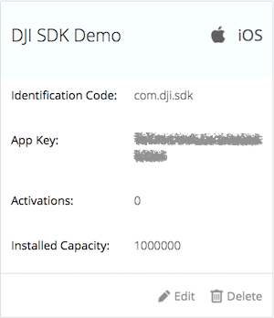
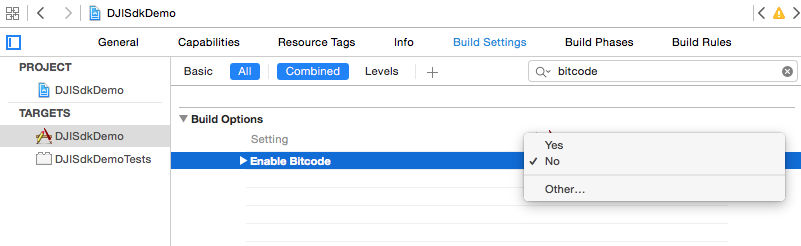

# DJI Mobile SDK for iOS

[English](#what-is-this) | [中文](#这是什么)

## What Is This?

The DJI Mobile SDK enables you to control how your Phantom’s camera, gimbal, and more behaves and interacts with mobile apps you create.Using the Mobile SDK, create a customized mobile app to unlock the full potential of your DJI aerial platform.

## Running the SDK Sample Code

This guide shows you how to setup APP Key and run our DJI Mobile SDK sample project, which you can download it from this **Github Page**.

### Prerequisites

- Xcode 6.4+ or higher
- Deployment target of 6.0 or higher

### Registering a App Key

Firstly, please go to your DJI Account's [User Center](http://developer.dji.com/en/user/mobile-sdk/), select the "Mobile SDK" tab on the left, press the "Create App" button and select "iOS" as your operating system. Then type in the info in the pop up dialog.

>Note: Please type in "com.dji.sdk" in the `Identification Code` field, because the default bundle identifier in the sample Xcode project is "com.dji.sdk".

Once you complete it, you may see the following App Key status:

Please record the App Key you just created and we will use it in the following steps.

### Running the Sample Xcode project

Open the "DJISdkDemo.xcodeproj" project in Xcode, modify the **AppDelegate.m** file by assigning the App Key string we just created to the **appKey** object like this:

~~~objc

- (BOOL)application:(UIApplication *)application didFinishLaunchingWithOptions:(NSDictionary *)launchOptions
{
    //Enter the App Key here
    NSString* appKey = @"**********************";
    [DJIAppManager registerApp:appKey withDelegate:self];
    
    self.window = [[UIWindow alloc] initWithFrame:[[UIScreen mainScreen] bounds]];
    UINavigationController* rootViewController = [[UINavigationController alloc] initWithRootViewController:[[DJIRootViewController alloc] initWithNibName:@"DJIRootViewController" bundle:nil]];
    [rootViewController.navigationBar setBackgroundColor:[UIColor blackColor]];
    [rootViewController setToolbarHidden:YES];
    self.window.rootViewController = rootViewController;
    // Override point for customization after application launch.
    self.window.backgroundColor = [UIColor whiteColor];
    [self.window makeKeyAndVisible];
    return YES;
}

~~~

>Note: If you are running the sample project with Xcode 7.0 above, please set "Enable Bitcode" value to No in the Build Settings as shown below:
>

Once you finish it, build and run the project and you can start to try different features in the sample project without any problems.

## Concepts

- [**DJI Mobile SDK Framework Handbook**](https://github.com/dji-sdk/Mobile-SDK-Handbook): 
This handbook provides a high level overview of the different components that make up the SDK, so that developers can get a feel for the SDK's structure and its different components. This handbook does not aim to provide specific information that can be found in the SDK. After reading through this handbook, developers should be able to begin working closely with the SDK.

## Sample Projects - Basic

- [**Creating a Camera Application**](https://github.com/DJI-Mobile-SDK/iOS-FPVDemo): Our introductory tutorial, which guides you through connecting to your drone's camera to display a live video feed in your app, through which you can take photos and videos.

## Sample Projects - Advanced

- [**Creating a Photo and Video Playback Application**](https://github.com/DJI-Mobile-SDK/iOS-PlaybackDemo): A follow up to the FPV tutorial, this tutorial teaches you how to construct an application to view media files onboard a DJI drone's SD card, specifically for **Phantom 3 Professional** and **Inspire 1**.

- [**Creating a MapView and Waypoint Application**](https://github.com/DJI-Mobile-SDK/iOS-GSDemo): Teaches you how to construct a Groundstation app, which allows you to plot a flight route for your drone by placing waypoints on a map.

- [**Creating a Panorama Application**](https://github.com/DJI-Mobile-SDK/iOS-PanoramaDemo):
Learn how to build a cool panorama app. With the help of the powerful DJI SDK and OpenCV libraries, it is actually easy. you will use the Waypoint feature of Intelligent Navigation and Joystick to rotate the aircraft to take photos.

## Gitbook

For better reading experience of DJI Mobile SDK Tutorials, please check our [**Gitbook**](https://dji-dev.gitbooks.io/mobile-sdk-tutorials/).

## SDK Reference

[**iOS SDK API Documentation**](http://developer.dji.com/mobile-sdk/documentation/)

## Support

You can get support from DJI with the following methods:

- [**DJI Forum**](http://forum.dev.dji.com/en)
- [**Stackoverflow**](http://stackoverflow.com) 
- dev@dji.com

---

## 这是什么?

使用DJI Mobile SDK开发App, 可以控制Phantom的相机，云台等更多部件实现个性化的航拍体验。你可以为DJI飞行平台量身定做移动APP，发挥出飞行器的最大潜力。关于飞行的一切创意，均可成为现实。

## 运行SDK示例代码

本教程展示了如何配置APP Key, 如何运行DJI Mobile SDK的示例代码，示例代码可以在当前的**Github Page**中下载。

### 开发工具版本要求

- Xcode 6.4+ or higher
- Deployment target of 6.0 or higher

### 开发工具版本要求

- Xcode 6.4 以上
- Xcode Deployment target 6.0 以上

### 注册App Key

首先, 请来到你的DJI 账号的[用户中心](http://developer.dji.com/en/user/mobile-sdk/), 选择左侧的 "Mobile SDK" 选项，然后点击“创建App”按钮，并且选择“iOS”作为开发平台. 接着在弹出的对话框中输入信息.

>注意: 请在`标识码`栏中输入"com.dji.sdk", 因为示例代码中的默认bundle identifier就是 "com.dji.sdk".

一旦你完成了注册，你将看到以下App Key的状态截图:

请记下刚刚创建好的App Key，我们会在接下来的步骤中用到。

### 运行Xcode示例代码

在Xcode中打开 "DJISdkDemo.xcodeproj"工程, 修改 **AppDelegate.m** 文件，将刚创建好的App Key字符串赋值给 **appKey** 对象，如下所示:

~~~objc

- (BOOL)application:(UIApplication *)application didFinishLaunchingWithOptions:(NSDictionary *)launchOptions
{
    //Enter the App Key here
    NSString* appKey = @"**********************";
    [DJIAppManager registerApp:appKey withDelegate:self];
    
    self.window = [[UIWindow alloc] initWithFrame:[[UIScreen mainScreen] bounds]];
    UINavigationController* rootViewController = [[UINavigationController alloc] initWithRootViewController:[[DJIRootViewController alloc] initWithNibName:@"DJIRootViewController" bundle:nil]];
    [rootViewController.navigationBar setBackgroundColor:[UIColor blackColor]];
    [rootViewController setToolbarHidden:YES];
    self.window.rootViewController = rootViewController;
    // Override point for customization after application launch.
    self.window.backgroundColor = [UIColor whiteColor];
    [self.window makeKeyAndVisible];
    return YES;
}

~~~

>注意: 如果你使用7.0版本以上的Xcode运行示例代码，请把Build Settings中的"Enable Bitcode"值设为No, 如下所示:
>
>

最后编译运行该工程，你就可以开始流畅地体验实例代码中的不同功能了。

## 基本概念

- [**DJI Mobile SDK Framework 指南**](https://github.com/dji-sdk/Mobile-SDK-Handbook): 

本指南针对SDK的各种抽象概念进行了解释，方便开发者对SDK的架构和各种概念有一个清晰的理解。 本指南不会提供SDK的详细信息，具体您可以直接在SDK中了解。在阅读完本指南后，开发者可以更容易上手我们的SDK。

## 示例教程 - 基础

- [**创建航拍相机App**](https://github.com/DJI-Mobile-SDK/iOS-FPVDemo): 这是我们的入门教程, 该教材会指导你如何连接飞行器的相机，在app上显示实时画面，以及如何进行拍摄和录像操作。

## 示例教程 - 高级

- [**创建照片和视频回放应用**](https://github.com/DJI-Mobile-SDK/iOS-PlaybackDemo): 你将会学到如何使用DJI Mobile SDK去访问飞机相机上的SD卡媒体资源。当你完成本教程后，你将开发出一款app，具备预览照片，播放视频，下载或者删除文件等功能. 该教材目前只针对**Phantom 3 Professional** 和 **Inspire 1**.

- [**创建智能飞行预设航点功能App**](https://github.com/DJI-Mobile-SDK/iOS-GSDemo): 你将学到如何安装使用 DJI PC 模拟器, 如何升级你的 Inspire 1, Phantom 3 Professional 和 Phantom 3 Advanced的固件到Beta版本, 以及如何使用DJI PC 模拟器去测试地面站的API. 同时, 你将学到地面站预设航点功能的基本使用流程.

- [**创建全景航拍App**](https://github.com/DJI-Mobile-SDK/iOS-PanoramaDemo):
在本教程中，你将开发一款很酷的全景app.使用DJI SDK 和 OpenCV库进行开发，会变得很容易.你将使用地面站的航点任务和飞行控制，去旋转飞行器机身和相机镜头进行拍照。

## Gitbook

如果你想拥有更好的阅读体验，可以看下我们的DJI Mobile SDK Tutorials [**Gitbook**](https://dji-dev.gitbooks.io/mobile-sdk-tutorials/).

## SDK API 文档

[**iOS SDK API 文档**](http://developer.dji.com/mobile-sdk/documentation/)

## 技术支持

你可以从以下方式获得DJI的技术支持：

- [**DJI论坛**](http://forum.dev.dji.com/cn)
- [**Stackoverflow**](http://stackoverflow.com) 
- dev@dji.com

