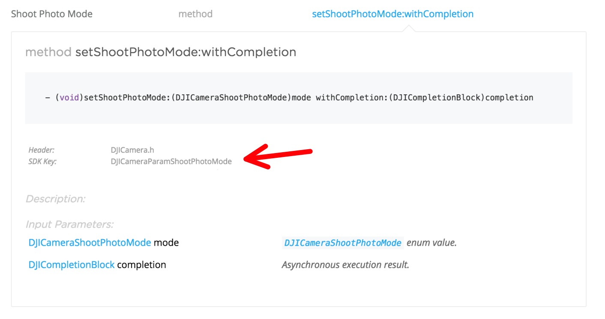

# Keyed Interface

## Overview
SDK 4.0 introduces a new set of interfaces, called _Keyed Interfaces_, to access the state information of the connected DJI product, in addition to the existing interfaces.

You can now access the state information of the product using ***get, set & action*** methods in the newly introduced `DJIKeyManager` using `DJIKey` objects. Also you can listen to state changes using a listener mechanism provided in `DJIKeyManager`.

As part of keyed interface implementation, SDK now contains an in-memory cache that temporarily caches product state information. In many cases, the cache reduces delays in responding of the SDK as it eliminates the roundtrip getter calls to the product when a valid value is available in the cache.

Below shows an example of accessing ISO value of the camera using the existing interface and the new keyed interface:

***Existing Interface***

~~~objectivec
[camera getISOWithCompletion:^(DJICameraISO iso, NSError * _Nullable error) {
    //Do something with ISO value
 }];	
~~~

***New Keyed Interface***

~~~objectivec
//Create Camera ISO key object
DJIKey * ISOkey = [DJICameraKey keyWithParam:DJICameraParamISO];

//Get ISO value from a generic getter interface
[[DJISDKManager keyManager] getValueForKey:ISOkey withCompletion:^(DJIKeyedValue * _Nullable keyedValue, NSError * _Nullable error) {
    DJICameraISO ISOValue = (DJICameraISO) [keyedValue.value integerValue];
    //Do something with ISO value    
}];
~~~

The power of keyed interface becomes apparent in case of state change listeners. In the below example, existing and new keyed interfaces are compared for listening to changes in aircraft altitude.

***Existing Interface***

~~~objectivec
...

//An object needs to set itself as the delegate to flight controller. LIMITATION: ONLY one object can be a delegate 
//to the flight controller at any given time.

flightController.delegate = self;

...
	
//Then the object needs to implement `flightController:didUpdateState:` method. This method is called 
//at high frequency irrespective of aircraft altitude is changed or not.

-(void)flightController:(DJIFlightController *)fc didUpdateState:(DJIFlightControllerState *)state
{
	float altitude = state.altitude;
	//Do something with altitude value
}
~~~

***New Keyed Interface***

~~~objectivec

...

//Create Flightcontroller altitude key object
DJIKey * altitudeKey = [DJIFlightControllerKey keyWithParam:DJIFlightControllerParamAltitudeInMeters];

//Add a listener block for altitude key. NOTE: You can add multiple listeners for the same key
[[DJISDKManager keyManager] startListeningForChangesOnKey: altitudeKey
                                             withListener: self
                                           andUpdateBlock: ^(DJIKeyedValue * _Nullable oldKeyedValue, DJIKeyedValue * _Nullable newKeyedValue) {
                                               
                                               //This block is called ONLY when the altitude value is changed
                                               if (newKeyedValue) {
                                                   float newAltitude = [newKeyedValue.value floatValue];
                                                   //Do something with altitude value
                                               }

                                           }];
...

~~~

>NOTE: You may recognize that the functionality of keyed interface in DJI SDK is similar to [iOS/macOS KVO](https://developer.apple.com/library/content/documentation/Cocoa/Conceptual/KeyValueObserving/KeyValueObserving.html). But DJI SDK improves on KVO by providing a block based observer/listener mechanism vs cumbersome delegate mechanism.

## Advantages of Keyed Interfaces

- **Multiple Listeners**: You can add multiple listeners to keys allowing different parts of your code to get notified on status changes.
- **Less Noisy Callbacks**: The listener blocks are called only on status changes reducing the number of times your blocks are called.
- **Improved UI layer code**: The listener mechanism simplifies view layer code significantly. Infact, the recently announced DJI UI Library only uses the keyed interface of the SDK.

## Overview of Keyed Interface Classes

### `DJIKey`
* `DJIKey` acts as an "address" to a state information of the connected product. 
* Each component in the SDK (eg. Camera, FlightController, etc.) has its own subclass of `DJIKey` (eg. `DJICameraKey`, `DJIFlightControllerKey`, etc.).
* In order to create a DJIKey object, use the class constructor method with "param keys". You can obtain the param keys for interface/state of a component from the documentation of its existing interface. You can also find all the available param keys of DJIKey subclass from its header file (eg. `DJICameraKey.h`).

* Examples of `DJIKey` constructor methods

~~~objectivec
DJIKey * cameraShootPhotoModeKey = [DJICameraKey keyWithParam:DJICameraParamShootPhotoMode];

//Addresses specific battery if the product has multiple batteries (eg. Matrice 600)    
DJIKey * chargeRemainingOfBattery2Key = [DJIBatteryKey keyWithIndex:2 andParam:DJIBatteryParamChargeRemaining]; 

DJIKey * isFlyingKey = [DJIFlightControllerKey keyWithParam:DJIFlightControllerParamIsFlying];

~~~

For more information on this class please refer to DJIKey interface documation in `DJIKey.h`.

### `DJIKeyManager`

[KeyManager](./API_Reference/Components/KeyManager/DJIKeyManager.html) acts as gateway to keyed interfaces. It offers ***get, set & action*** methods and listener interfaces. Please refer to [KeyManager](./API_Reference/Components/KeyManager/DJIKeyManager.html) documentation for more information on this class.

### `DJIKeyedValue`

`DJIKeyedValue` is a container object that "contains" the state value. One of the properties of this object is a `value` property which can be type casted to suitable class based on the keyed value. The type information of the `value` property is almost always same as the type information of the existing interfaces. 

>NOTE: 
>
>1. Primitive values are returned as `NSNumber`
>2. Structs are returned as NSValue
>3. Objects are returned as `id` which can then be typecasted to desired objects

Example: Using the same ISO example, line below "LOOK HERE" for an example of obtaining contained value of an `DJIKeyedValue` object.

~~~objectivec
//Get ISO value from a generic getter interface
[[DJISDKManager keyManager] getValueForKey:ISOkey withCompletion:^(DJIKeyedValue * _Nullable keyedValue, NSError * _Nullable error) {

	//LOOK HERE
    DJICameraISO ISOValue = (DJICameraISO) [keyedValue.value integerValue];
    //Do something with ISO value    
    
}];
~~~

## Sample Code

You can find the keyed interface sample code in this Github SDK Sample Code. 